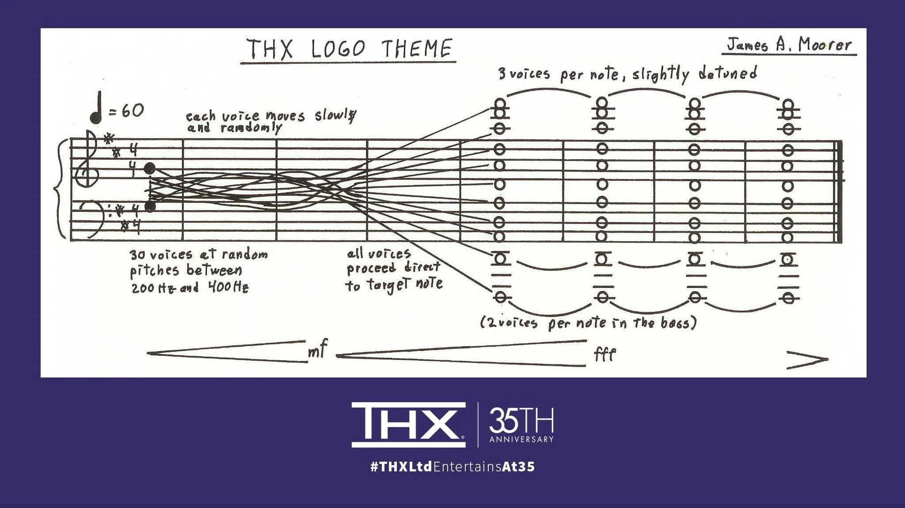

# neoTHX
A THX like **BRRRRRRRRAAAAAAAAAAAAAA** tone

![simpsons][video/THXSimpsons.mp4]

After the shepard tone programs of last week, I thought they sounded awlfully like the THX sound.
So naturally this week, I implimented my version of the THX Deepnote, with the option to make it last forever with a shepard tone. On the left panel you'll see an option to select either an up or down infinite tone.

It took me all sunday to come up with the visulisation, but I think it was worth it to see how the notes swing around and to verify it against the score from THX.
Click the Frequency History tab on the top left to see it.


PLAY IT LOUD, OK!



## HOW it works

## Frequency Convergence

Each Deep Note voice has a current oscillator frequency and a target frequency. The oscillator's actual frequency does not jump immediately to the target; instead, it follows the target through a low-pass, or one-pole smoothing, process.

Conceptually, the frequency update can be represented as:

$$
f_n(t+1) = f_n(t) + \alpha\left(f_{\mathrm{target},n}(t) - f_n(t)\right)
$$

where:

* $f_n$ is the current frequency of oscillator $n$
* $f_{\mathrm{target},n}$ is its currently assigned target frequency
* $\alpha$ is the smoothing coefficient

A smaller smoothing coefficient causes the oscillator to approach its target more slowly.

This smoothing is an important part of the Deep Note effect. Rather than hearing a series of discrete pitch changes, we hear each voice gliding continuously between frequencies.

### Random Frequency Assignment

During the initial chaotic phase, the program loops through the voices approximately once per second, assigning each voice a new random frequency.

For example:

|  Time |  V1 |  V2 |  V3 |  V4 |
| ----: | --: | --: | --: | --: |
| 0 sec | 273 | 341 | 218 | 387 |
| 1 sec | 301 | 229 | 366 | 274 |
| 2 sec | 248 | 319 | 207 | 352 |
| 3 sec | 335 | 211 | 298 | 381 |

These changes are not instantaneous because of the frequency smoothers. Each oscillator continuously moves toward its newly assigned random target.

### Convergence

At a predetermined point, the random behaviour stops.

The program effectively switches from random changes to a fixed set of final target frequencies:

```text
Voice 1  → target frequency A
Voice 2  → target frequency B
Voice 3  → target frequency C
...
Voice 30 → target frequency D
```

The oscillators still do not jump to their final frequencies. The same frequency-smoothing process causes every voice to glide toward its assigned final pitch.

The result is a gradual convergence from the initial chaotic cluster into a single, very large chord.

## Final Frequency Structure

The reconstructed final frequency structure is based around a 150 Hz root:

| Target | Frequency |
| -----: | --------: |
|      1 |   37.5 Hz |
|      2 |     75 Hz |
|      3 |    150 Hz |
|      4 |    300 Hz |
|      5 |    600 Hz |
|      6 |    900 Hz |
|      7 |   1200 Hz |
|      8 |   1500 Hz |
|      9 |   1800 Hz |

The frequency relationships can be expressed as:

```text
37.5
  ×2
75
  ×2
150
  ×2
300
  ×2
600
  ×1.5
900
  ×4/3
1200
  ×1.25
1500
  ×1.2
1800
```

Multiple voices can therefore be assigned within this overall frequency structure, producing a dense final chord rather than a single pitch.

Small amounts of deliberate detuning are retained between voices. These tiny differences in frequency produce beating between the voices, contributing to the characteristic shimmering quality of the final chord.

## Implementation Fidelity

This implementation is intended to be algorithmically faithful rather than bit-for-bit identical to the original Deep Note.

The broad characteristics — approximately 200–400 Hz initial frequency range, 30 voices, a cello-derived waveform, one-pole frequency smoothing, periodic random reassignment, convergence toward a final structure based around a 150 Hz root, and deliberate residual detuning — are supported by James Moorer's accounts of the original system.

This implementation therefore reproduces the documented principles and behaviour without claiming to be an exact recreation of the original program, hence the neo prefix.


